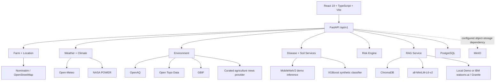

# AgriGuard AI — Technical Architecture

> **Document status:** Current implementation reference  
> **Last reconciled:** 2026-09-30  
> **Scope:** `main` branch of `tejaswin-amara/AgriGuard-AI`

This document describes the architecture that is actually present in the repository. It deliberately separates implemented behavior from future production work.

## 1. System overview

AgriGuard AI is a full-stack agricultural decision-support prototype with four main layers:

1. **React frontend** — farm dashboard, farm setup, soil analysis, disease analysis, insights, advisory history, responsible-AI information, and about page.
2. **FastAPI backend** — REST API, request validation, orchestration, persistence, model integration, provider integration, risk calculation, and advisory generation.
3. **ML/RAG layer** — a deterministic MobileNetV2 disease demo, an XGBoost soil classifier trained from synthetic heuristic data, ChromaDB retrieval, sentence-transformer embeddings, and a configurable local/IBM Granite generation layer.
4. **Infrastructure/data services** — PostgreSQL, MinIO, Docker Compose, GitHub Actions, and local ChromaDB persistence.

## 2. Runtime architecture



## 3. Repository architecture

| Path | Responsibility |
|---|---|
| `backend/app/api/routes/` | REST endpoint modules |
| `backend/app/services/` | Application services, RAG, LLM, risk, ML integration |
| `backend/app/services/external/` | Provider interfaces, transport, cache, registry, typed external data |
| `backend/app/models/` | SQLModel persistence models |
| `backend/app/schemas/` | Pydantic API contracts |
| `backend/tests/` | Backend API, database, provider, and RAG tests |
| `models/disease/` | MobileNetV2 demo architecture and inference |
| `models/soil/` | Synthetic-data generation, XGBoost training/inference |
| `rag/corpus/` | Three demo advisory Markdown documents |
| `rag/ingestion/` | ChromaDB corpus ingestion |
| `rag/retrieval/` | Semantic retrieval |
| `frontend/src/pages/` | User-facing application pages |
| `frontend/src/components/` | Reusable UI elements |
| `frontend/tests/e2e/` | Playwright smoke/critical-journey tests |
| `docker-compose.yml` | Local PostgreSQL, MinIO, backend and frontend services |

## 4. API layer

The FastAPI application is created in `backend/app/main.py` with:

- application version `2.0.0`;
- API prefix `/api/v1`;
- explicit CORS origins from configuration;
- OpenAPI JSON at `/api/v1/openapi.json`;
- route groups for health, farms, location, weather, environment, providers, news, biodiversity, disease, soil, and advisory history/generation.

Database tables are currently created from SQLModel metadata during application startup. Alembic is present in the repository, including an initial revision, but the current application startup path does not invoke Alembic.

## 5. Persistence model

PostgreSQL is the intended local relational database. The repository defines:

- `Farm`
- `FarmLocation`
- `ExternalObservation`
- `WeatherSnapshot`
- `ClimateSnapshot`
- `EnvironmentSnapshot`
- `DiseaseAnalysis`
- `SoilReading`
- `AdvisoryRecord`

The API persists farm records, disease-analysis records, soil readings, and advisory records. The snapshot models provide a schema for richer historical storage.

## 6. External provider architecture

All providers implement capability-specific interfaces derived from `ExternalDataProvider`.

Implemented adapters:

| Provider | Capability | Required flag |
|---|---|---|
| Open-Meteo | current weather + forecast | Yes |
| NASA POWER | historical agroclimate | Yes |
| Nominatim / OpenStreetMap | geocoding | Yes |
| OpenAQ | air quality | No |
| Open Topo Data / ETOPO1 | elevation | No |
| GBIF | biodiversity observations | No |
| Curated agriculture news provider | demo advisory/outbreak news | No |

The provider cache is in-process and uses TTL policies for each capability. It supports cache freshness states, stale-cache fallback, and in-flight request coalescing.

## 7. Farm context orchestration

`FarmContextService` coordinates location resolution plus weather, climate, air-quality, elevation, biodiversity, and news retrieval concurrently with `asyncio.gather(..., return_exceptions=True)`.

The resulting `FarmContextResponse` includes:

- farm metadata;
- geocoded location;
- weather and short forecast;
- historical climate summary;
- optional environmental data;
- qualitative risk context;
- provider health;
- freshness states.

The current implementation still contains deterministic mock fallbacks for weather and climate when the live provider path fails. This is prototype resilience behavior and must not be treated as observed field data.

## 8. Risk engine

`RiskEngine` converts available environmental inputs into qualitative signals rather than calibrated probabilities.

Current signals:

- **fungal pressure:** `low`, `moderate`, or `elevated`;
- **water stress:** `optimal`, `moderate`, or `severe`;
- **heat stress:** `none`, `mild`, or `high`;
- **overall level:** `low`, `moderate`, or `elevated`.

The rules use humidity, temperature, precipitation, soil moisture, recent rainfall, dry-spell duration, ET₀, VPD, and available climate data. These are heuristic decision-support signals, not statistical probabilities.

## 9. ML architecture

### Disease

`models/disease/model.py` defines a three-class MobileNetV2 architecture. The active `DiseaseInference` implementation does not load trained weights; it validates the image and returns a deterministic demo result.

Current class labels:

- `Healthy`
- `Leaf Blight`
- `Rust`

The active inference path currently returns `Leaf Blight` with a fixed demo confidence value. That value is not calibrated model confidence.

### Soil

`models/soil/train.py` generates 1,000 synthetic samples across N, P, K, pH, and moisture and derives labels from heuristic rules. An XGBoost classifier is trained and written to `soil_model_synthetic.pkl`.

Inference returns one of:

- `Optimal`
- `High Risk (pH imbalance)`
- `Suboptimal (Stress)`

If the generated model artifact is missing, the current inference code uses a deterministic fallback.

## 10. RAG architecture

The repository contains a small Markdown corpus under `rag/corpus/`.

Ingestion:

```text
Markdown -> front-matter parsing -> one chunk/document -> Sentence Transformer -> ChromaDB
```

Retrieval:

```text
Query -> embedding -> ChromaDB similarity search -> top retrieved documents -> advisory context
```

The current advisory service uses up to three retrieved citations and refuses to fabricate an advisory when no evidence is retrieved.

The corpus is a **demo corpus**, not a comprehensive or field-validated agricultural evidence base.

## 11. LLM architecture

`backend/app/services/llm.py` exposes an abstract provider interface.

### Local demo provider

Used by default when IBM credentials are absent. It produces deterministic, bounded text from the retrieved context.

### IBM watsonx.ai / Granite

Used when both `WATSONX_API_KEY` and `WATSONX_PROJECT_ID` are configured. The configured SDK is `ibm-watsonx-ai`.

Generation is constrained by an evidence-grounding prompt. Initialization or generation errors fall back to the local provider.

## 12. Infrastructure

Docker Compose provisions:

- PostgreSQL 16 Alpine;
- MinIO;
- FastAPI backend on port 8000;
- React static frontend served by Nginx on port 80.

The repository also defines GitHub Actions for backend tests/linting, frontend lint/build/E2E checks, security scanning, and Docker build scanning.

## 13. Verification status

The latest inspected `main` CI run on 2026-09-29 had:

- backend tests: **success**;
- security scan: **success**;
- Docker build/scan: **success**;
- frontend job: **failure** at the Biome check, with 29 reported formatting/lint errors, preventing subsequent frontend build and Playwright steps in that run.

Therefore this repository should **not** be described as having a currently green all-check CI pipeline until a later run proves it.

## 14. Known implementation gaps

These are intentionally documented rather than hidden:

- no authentication/authorization layer is implemented;
- disease inference is demo-only;
- soil training data is synthetic;
- the advisory corpus is demo-sized;
- the news provider is static/curated rather than a live feed;
- deterministic fallback providers exist for prototype/testing paths;
- MinIO is configured but the disease upload path currently records an image key without storing the uploaded bytes through the MinIO client;
- frontend API requests use a relative `/api/v1` base URL, while the shipped Nginx container does not contain a reverse-proxy rule to the backend;
- Alembic exists but startup currently calls SQLModel table creation directly;
- production deployment, rate limiting, authentication, observability backends, and mobile/offline support are not implemented.

## 15. Security posture

Repository-level controls currently include:

- MIME and 10 MB size validation for disease image uploads;
- explicit CORS defaults;
- Gitleaks in pre-commit/CI;
- Trivy scanning in CI;
- dependency update automation through Dependabot;
- input constraints in Pydantic schemas;
- prompt-injection-aware wording in the Granite prompt;
- explicit provenance and limitation fields.

These measures do not make the prototype production-secure. The threat model and security policy remain the authoritative security documentation.

## 16. Related documents

- [README](README.md)
- [Data & Models](DATA_AND_MODELS.md)
- [Dataset Card](docs/dataset-card/DATASET_CARD.md)
- [Disease Model Card](docs/model-card/DISEASE_MODEL_CARD.md)
- [Soil Model Card](docs/model-card/SOIL_MODEL_CARD.md)
- [Demo Guide](docs/demo/DEMO.md)
- [Architecture ADRs](docs/architecture/adr/)
- [Runbooks](docs/runbooks/)
- [Internship Compliance](docs/INTERNSHIP-COMPLIANCE.md)
- [Security Policy](SECURITY.md)
